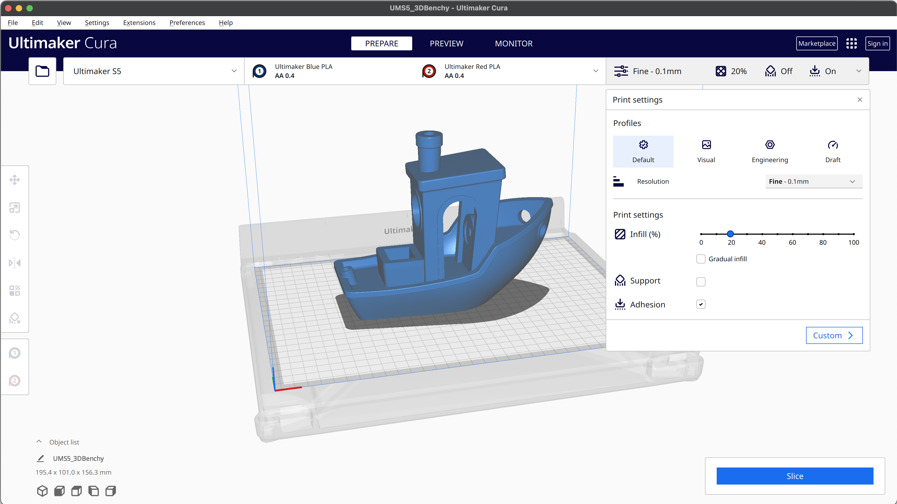

 

[![Badge Issues]][Issues]   
[![Badge PullRequests]][PullRequests]   
[![Badge Closed]][Closed]

[![Badge Size]][#]   
[![Badge License]][License]   
[![Badge Contributors]][Contributors]

[![Badge Test]][Test]   
[![Badge Conan]][Conan]   
[![Badge Downloads]][Downloads]
 
 

![Logo]

# Ultimaker Cura

*State-of-the-art slicer app to prepare*  
*your 3D models for your 3D printer.*

*With hundreds of settings & community-managed print profiles,*  
*Ultimaker Cura is sure to lead your next project to a success.*

 
 

[![Button Building]][Building]   
[![Button Plugins]][Plugins]   
[![Button Machines]][Machines]

[![Button Report]][Report]   
[![Button Settings]][Settings]   
[![Button Localize]][Localize]

 
 

<picture>
  <source media="(prefers-color-scheme: light)" srcset="./cura-logo.PNG">
  <source media="(prefers-color-scheme: dark)" srcset="./cura-logo-dark.PNG">
  
</picture>

 

 

<!----------------------------------------------------------------------------->

[Contributors]: https://github.com/Ultimaker/Cura/graphs/contributors
[PullRequests]: https://github.com/Ultimaker/Cura/pulls
[Machines]: https://github.com/Ultimaker/Cura/wiki/Adding-new-machine-profiles-to-Cura
[Building]: https://github.com/Ultimaker/Cura/wiki/Getting-Started
[Localize]: https://github.com/Ultimaker/Cura/wiki/Translating-Cura
[Settings]: https://github.com/Ultimaker/Cura/wiki/Profiles-&-Settings
[Plugins]: https://github.com/Ultimaker/Cura/wiki/Plugins-And-Packages
[Closed]: https://github.com/Ultimaker/Cura/issues?q=is%3Aissue+is%3Aclosed
[Issues]: https://github.com/Ultimaker/Cura/issues
[Conan]: https://github.com/Ultimaker/Cura/actions/workflows/conan-package.yml
[Test]: https://github.com/Ultimaker/Cura/actions/workflows/unit-test.yml
[Downloads]: https://github.com/Ultimaker/Cura/releases/latest

[License]: LICENSE
[Report]: docs/Report.md
[Logo]: resources/images/cura-icon.png
[#]: #

<!---------------------------------[ Badges ]---------------------------------->

[Badge Contributors]: https://img.shields.io/github/contributors/ultimaker/cura?style=for-the-badge&logoColor=white&labelColor=db5e8a&color=ab4a6c&logo=GitHub
[Badge PullRequests]: https://img.shields.io/github/issues-pr/ultimaker/cura?style=for-the-badge&logoColor=white&labelColor=bb9f3e&color=937d31&logo=GitExtensions
[Badge License]: https://img.shields.io/badge/License-LGPL3-336887.svg?style=for-the-badge&labelColor=458cb5&logoColor=white&logo=GNU
[Badge Closed]: https://img.shields.io/github/issues-closed/ultimaker/cura?style=for-the-badge&logoColor=white&labelColor=629944&color=446a30&logo=AddThis
[Badge Issues]: https://img.shields.io/github/issues/ultimaker/cura?style=for-the-badge&logoColor=white&labelColor=c34360&color=933349&logo=AdBlock
[Badge Conan]: https://img.shields.io/github/actions/workflow/status/Ultimaker/Cura/conan-package.yml?branch=main&style=for-the-badge&logoColor=white&labelColor=6185aa&color=4c6987&logo=Conan&label=Conan%20Package
[Badge Test]: https://img.shields.io/github/actions/workflow/status/Ultimaker/Cura/unit-test.yml?branch=main&style=for-the-badge&logoColor=white&labelColor=4a999d&color=346c6e&logo=Codacy&label=Unit%20Test
[Badge Size]: https://img.shields.io/github/repo-size/ultimaker/cura?style=for-the-badge&logoColor=white&labelColor=715a97&color=584674&logo=GoogleAnalytics
[Badge Downloads]: https://img.shields.io/github/downloads-pre/Ultimaker/Cura/latest/total?style=for-the-badge

<!---------------------------------[ Buttons ]--------------------------------->

[Button Localize]: https://img.shields.io/badge/Help_Localize-e2467d?style=for-the-badge&logoColor=white&logo=GoogleTranslate
[Button Machines]: https://img.shields.io/badge/Adding_Printers-yellow?style=for-the-badge&logoColor=white&logo=CloudFoundry
[Button Settings]: https://img.shields.io/badge/Configuration-00979D?style=for-the-badge&logoColor=white&logo=CodeReview
[Button Building]: https://img.shields.io/badge/Building_Cura-blue?style=for-the-badge&logoColor=white&logo=GitBook
[Button Plugins]: https://img.shields.io/badge/Plugin_Usage-569A31?style=for-the-badge&logoColor=white&logo=ROS
[Button Report]: https://img.shields.io/badge/Report_Issues-C9284D?style=for-the-badge&logoColor=white&logo=Cliqz

