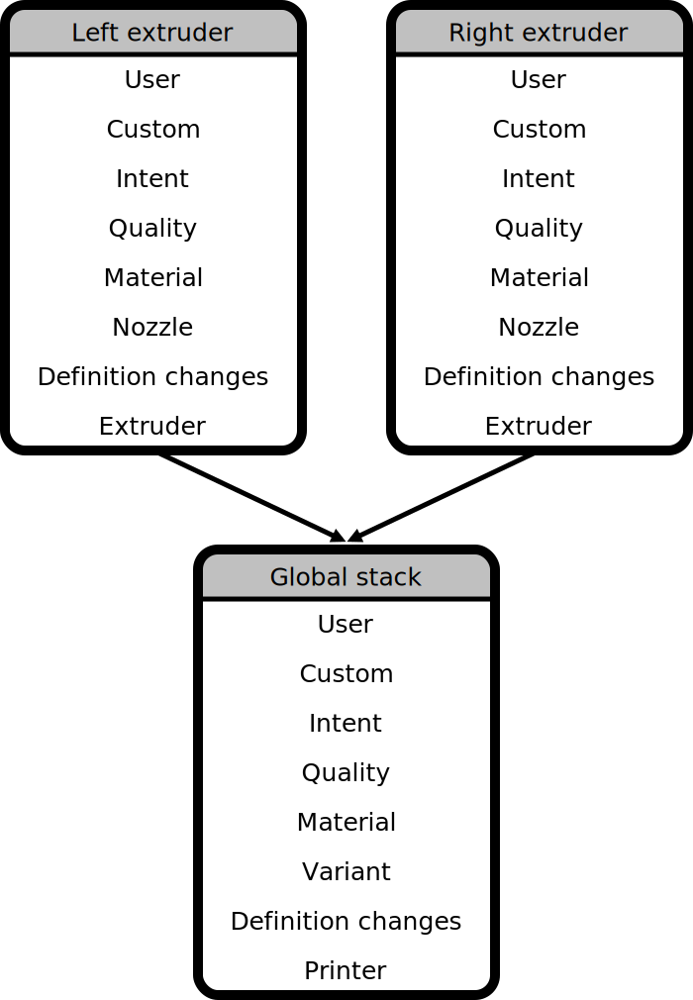

Container Stacks
====
When the user selects the profiles and settings to print with, he can swap out a number of profiles. The profiles that are currently in use are stored in several container stacks. These container stacks always have a definition container at the bottom, which defines all available settings and all available properties for each setting. The profiles on top of that definition can then override the `value` property of some of those settings.

When deriving a setting value, a container stack starts looking at the top-most profile to see if it contains an override for that setting. If it does, it returns that override. Otherwise, it looks into the second profile. If that also doesn't have an override for this setting, it looks into the third profile, and so on. The last profile is always a definition container which always contains an value for all settings. This way, the profiles at the top will always win over the profiles at the bottom. There is a clear precedence order for which profile wins over which other profile.

A Machine Instance
----
A machine instance is a printer that the user has added to his configuration. It consists of multiple container stacks: One for global settings and one for each of the available extruders. This way, different extruders can contain different materials and quality profiles, for instance. The global stack contains a different set of profiles than the extruder stacks.

While Uranium defines no specific roles for the entries in a container stack, Cura defines rigid roles for each slot in a container stack. These are the layouts for the container stacks of an example printer with 2 extruders.

To expand on this a bit further, each extruder stack contains the following profiles:
* A user profile, where extruder-specific setting changes are stored that are not (yet) saved to a custom profile. If the user changes a setting that can be adjusted per extruder (such as infill density) then it gets stored here. If the user adjusts a setting that is global it will immediately be stored in the user profile of the global stack.
* A custom profile. If the user saves his setting changes to a custom profile, it gets moved from the user profile to here. Actually a "custom profile" as the user sees it consists of multiple profiles: one for each extruder and one for the global settings.
* An intent profile. The user can select between several intents for his print, such as precision, strength, visual quality, etc. This may be empty as well, which indicates the "default" intent.
* A quality profile. The user can select between several quality levels.
* A material profile, where the user selects which material is loaded in this extruder.
* A nozzle profile, where the user selects which nozzle is installed in this extruder.
* Definition changes, which stores the changes that the user made for this extruder in the Printer Settings dialogue.
* Extruder. The user is not able to swap this out. This is a definition that lists the extruder number for this extruder and optionally things that are fixed in the printer, such as the nozzle offset.

The global container stack contains the following profiles:
* A user profile, where global setting changes are stored that are not (yet) saved to a custom profile. If the user changes for instance the layer height, the new value for the layer height gets stored here.
* A custom profile. If the user saves his setting changes to a custom profile, the global settings that were in the global user profile get moved here.
* An intent profile. Currently this must ALWAYS be empty. There are no global intent profiles. This is there for historical reasons.
* A quality profile. This contains global settings that match with the quality level that the user selected. This global quality profile cannot be specific to a material or nozzle.
* A material profile. Currently this must ALWAYS be empty. There are no global material profiles. This is there for historical reasons.
* A variant profile. Currently this must ALWAYS be empty. There are no global variant profiles. This is there for historical reasons.
* Definition changes, which stores the changes that the user made to the printer in the Printer Settings dialogue.
* Printer. This specifies the currently used printer model, such as Ultimaker 3, Ultimaker S5, etc.