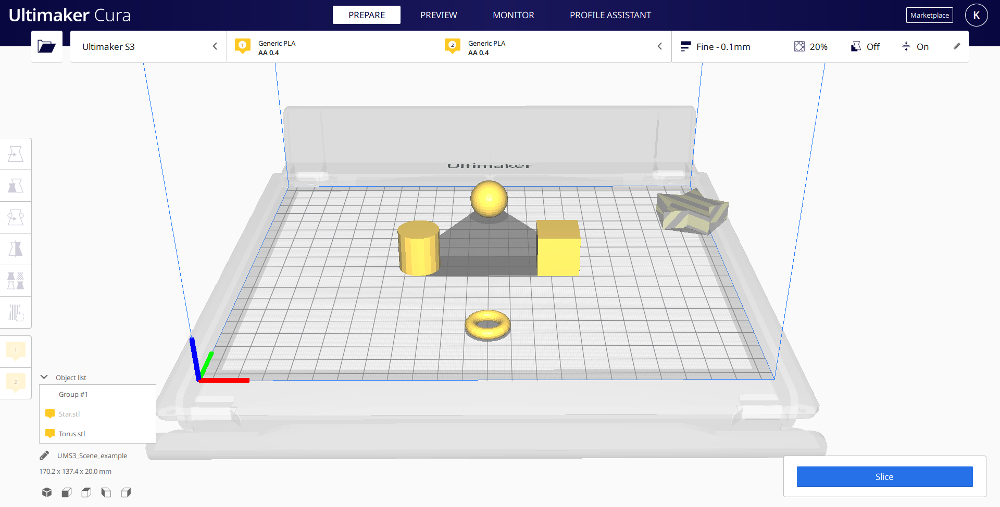

Scene
====
The 3D scene in Cura is designed as a [Scene Graph](https://en.wikipedia.org/wiki/Scene_graph), which is common in many 3D graphics applications. The scene graph of Cura is usually very flat, but has the possibility to have nested objects which inherit transformations from each other.

Scene Graph
----
Cura's scene graph is a mere tree data structure. This tree contains all scene nodes, which represent the objects in the 3D scene.

The main idea behind the scene tree is that each scene node has a transformation applied to it. The scene nodes can be nested beneath other scene nodes. The transformation of the parents is then also applied to the children. This way you can have scene nodes grouped together and transform the group as a whole. Since the transformations are all linear, this ensures that the elements of this group stay in the same relative position and orientation. It will look as if the whole group is a single object. This idea is very common for games where objects are often composed of multiple 3D models but need to move together as a whole. For Cura it is used to group objects together and to transform the collision area correctly.

Class Diagram
====

The following class diagram depicts the classes that interact with the Scene


The scene lives in the Controller of the Application, and it is primarily interacting with SceneNode objects, which are the components of the Scene Graph. 


A Typical Scene
----
Cura's scene has a few nodes that are always present, and a few nodes that are repeated for every object that the user loads onto their build plate. The root of the scene graph is a SceneNode that lives inside the Scene and contains all the other children SceneNodes of the scene. Typically, inside the root you can find the SceneNodes that are always loaded, such as the Cameras and the [BuildVolume](build_volume.md) (which contains the Platform), and the objects that are loaded on the platform.

Let's take the following example Scene:



The scene graph in this case is the following:


As it is visible, aside from the BuildVolume, the Cameras, and the objects, the root SceneNode also contains all the ConvexHullNodes, which are used to display the convex hull of each object and each group of objects. A ConvexHullNode is always loaded for each of the existing CuraSceneNodes


Accessing SceneNodes in the Scene
----

SceneNodes can be accessed using a `BreadthFirstIterator` or a `DepthFirstIterator`. Each iterator traverses the scene graph and returns a Python iterator, which yields all the SceneNodes and their children. 

``` python
for node in BreadthFirstIterator(scene.getRoot()):
    # do stuff with the node
```

Example result when iterating the above scene graph:

```python
[i for i in BreadthFirstIterator(self._root)]
```
  * 00 = {SceneNode} <SceneNode object: 'Root'>
  * 01 = {BuildVolume} <BuildVolume object '0x2e35dbce108'>
  * 02 = {Camera} <Camera object: '3d'>
  * 03 = {CuraSceneNode} <CuraSceneNode object: 'Torus.stl'>
  * 04 = {CuraSceneNode} <CuraSceneNode object: 'Group #1'>
  * 05 = {Camera} <Camera object: 'snapshot'>
  * 06 = {CuraSceneNode} <CuraSceneNode object: 'Star.stl'>
  * 07 = {ConvexHullNode} <ConvexHullNode object: '0x2e3000def08'>
  * 08 = {ConvexHullNode} <ConvexHullNode object: '0x2e36861bd88'>
  * 09 = {ConvexHullNode} <ConvexHullNode object: '0x2e3000bd4c8'>
  * 10 = {ConvexHullNode} <ConvexHullNode object: '0x2e35fbb62c8'>
  * 11 = {ConvexHullNode} <ConvexHullNode object: '0x2e3000a0648'>
  * 12 = {ConvexHullNode} <ConvexHullNode object: '0x2e30019d0c8'>
  * 13 = {ConvexHullNode} <ConvexHullNode object: '0x2e3001a2dc8'>
  * 14 = {Platform} <Platform object '0x2e35a001948'>
  * 15 = {CuraSceneNode} <CuraSceneNode object: 'Group #2'>
  * 16 = {CuraSceneNode} <CuraSceneNode object: 'Sphere.stl'>
  * 17 = {CuraSceneNode} <CuraSceneNode object: 'Cylinder.stl'>
  * 18 = {CuraSceneNode} <CuraSceneNode object: 'Cube.stl'>

Layer Data
----

Once the Slicing has completed and the CuraEngine has returned the slicing data, Cura creates a CuraSceneNode inside the BuildVolume which holds all the layer data. This CuraSceneNode can be identified via its LayerDataDecorator.


**Note:** This CuraSceneNode is created once Cura has completed processing the Layer data (after the user clicks on the Preview tab after slicing). The CuraSceneNode then is destroyed once any action that changes the Scene occurs (e.g. if the user moves/rotates/scales an object or changes a setting value).