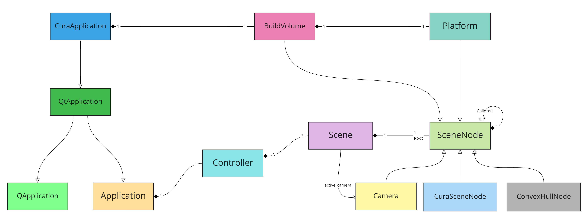
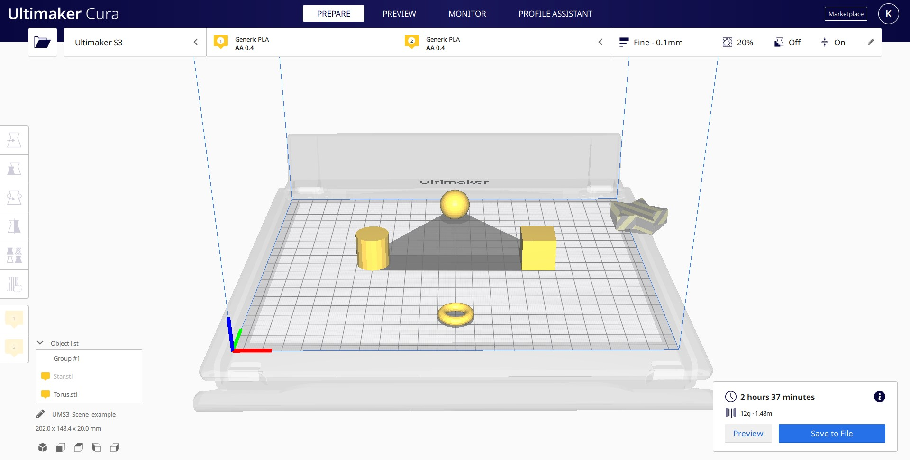
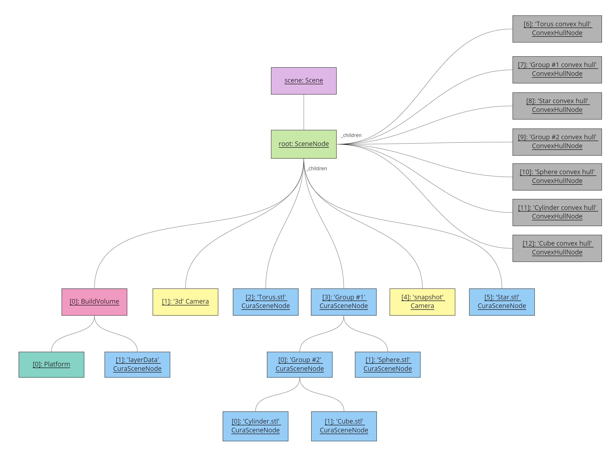
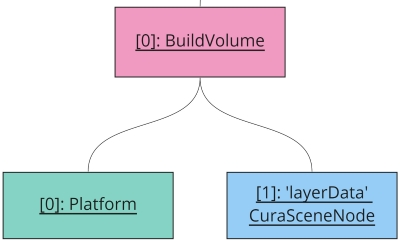

Scene
====
The 3D scene in Cura is designed as a [Scene Graph](https://en.wikipedia.org/wiki/Scene_graph), which is common in many 3D graphics applications. The scene graph of Cura is usually very flat, but has the possibility to have nested objects which inherit transformations from each other.

Scene Graph
----
Cura's scene graph is a mere tree data structure. This tree contains all scene nodes, which represent the objects in the 3D scene.

The main idea behind the scene tree is that each scene node has a transformation applied to it. The scene nodes can be nested beneath other scene nodes. The transformation of the parents is then also applied to the children. This way you can have scene nodes grouped together and transform the group as a whole. Since the transformations are all linear, this ensures that the elements of this group stay in the same relative position and orientation. It will look as if the whole group is a single object. This idea is very common for games where objects are often composed of multiple 3D models but need to move together as a whole. For Cura it is used to group objects together and to transform the collision area correctly.

Class Diagram
----

The following class diagram depicts the classes that interact with the Scene



The scene lives in the Controller of the Application, and it is primarily interacting with SceneNode objects, which are the components of the Scene Graph. 


A Typical Scene
----
Cura's scene has a few nodes that are always present, and a few nodes that are repeated for every object that the user loads onto their build plate. The root of the scene graph is a SceneNode that lives inside the Scene and contains all the other children SceneNodes of the scene. Typically, inside the root you can find the SceneNodes that are always loaded (the Cameras, the [BuildVolume](build_volume.md), and the Platform), the objects that are loaded on the platform, and finally a ConvexHullNode for each object and each group of objects in the Scene. 

Let's take the following example Scene:



The scene graph in this case is the following:




**Note 1:** The Platform is actually a child of the BuildVolume.

**Note 2:** The ConvexHullNodes are not actually named after the object they decorate. Their names are used in the image to convey how the ConvexHullNodes are related to the objects in the scene.

**Note 3:** The CuraSceneNode that holds the layer data (inside the BuildVolume) is created and destroyed according to the availability of sliced layer data provided by the CuraEngine. See the [LayerDataDecorator](#layerdatadecorator) for more information.

Accessing SceneNodes in the Scene
----

SceneNodes can be accessed using a `BreadthFirstIterator` or a `DepthFirstIterator`. Each iterator traverses the scene graph and returns a Python iterator, which yields all the SceneNodes and their children. 

``` python
for node in BreadthFirstIterator(scene.getRoot()):
    # do stuff with the node
```

Example result when iterating the above scene graph:

```python
[i for i in BreadthFirstIterator(CuraApplication.getInstance().getController().getScene().getRoot()]
```
  * 00 = {SceneNode} <SceneNode object: 'Root'>
  * 01 = {BuildVolume} <BuildVolume object '0x2e35dbce108'>
  * 02 = {Camera} <Camera object: '3d'>
  * 03 = {CuraSceneNode} <CuraSceneNode object: 'Torus.stl'>
  * 04 = {CuraSceneNode} <CuraSceneNode object: 'Group #1'>
  * 05 = {Camera} <Camera object: 'snapshot'>
  * 06 = {CuraSceneNode} <CuraSceneNode object: 'Star.stl'>
  * 07 = {ConvexHullNode} <ConvexHullNode object: '0x2e3000def08'>
  * 08 = {ConvexHullNode} <ConvexHullNode object: '0x2e36861bd88'>
  * 09 = {ConvexHullNode} <ConvexHullNode object: '0x2e3000bd4c8'>
  * 10 = {ConvexHullNode} <ConvexHullNode object: '0x2e35fbb62c8'>
  * 11 = {ConvexHullNode} <ConvexHullNode object: '0x2e3000a0648'>
  * 12 = {ConvexHullNode} <ConvexHullNode object: '0x2e30019d0c8'>
  * 13 = {ConvexHullNode} <ConvexHullNode object: '0x2e3001a2dc8'>
  * 14 = {Platform} <Platform object '0x2e35a001948'>
  * 15 = {CuraSceneNode} <CuraSceneNode object: 'Group #2'>
  * 16 = {CuraSceneNode} <CuraSceneNode object: 'Sphere.stl'>
  * 17 = {CuraSceneNode} <CuraSceneNode object: 'Cylinder.stl'>
  * 18 = {CuraSceneNode} <CuraSceneNode object: 'Cube.stl'>

SceneNodeDecorators
----

SceneNodeDecorators are decorators that can be added to the nodes of the scene to provide them with additional functions. 

Cura provides the following classes derived from the SceneNodeDecorator class:
  1. [GroupDecorator](#groupdecorator)
  2. [ConvexHullDecorator](#convexhulldecorator)
  3. [SettingOverrideDecorator](#settingoverridedecorator)
  4. [SliceableObjectDecorator](#sliceableobjectdecorator)
  5. [LayerDataDecorator](#layerdatadecorator)
  6. [ZOffsetDecorator](#zoffsetdecorator)
  7. [BlockSlicingDecorator](#blockslicingdecorator)
  8. [GCodeListDecorator](#gcodelistdecorator)
  9. [BuildPlateDecorator](#buildplatedecorator)

GroupDecorator
----

Whenever objects on the build plate are grouped together, a new node is added in the scene as the parent of the grouped objects. Group nodes can be identified when traversing the SceneGraph by running the following:

```python
node.callDecoration("isGroup") == True
```

Group nodes decorated by GroupDecorators are added in the scene either by reading project files which contain grouped objects, or when the user selects multiple objects and groups them together (Ctrl + G).

Group nodes that are left with only one child are removed from the scene, making their only child a child of the group's parent. In addition, group nodes without any remaining children are removed from the scene.

ConvexHullDecorator
----

As seen in the scene graph of the scene example, each CuraSceneNode that represents an object on the build plate is linked to a ConvexHullNode which is rendered as the object's shadow on the build plate. The ConvexHullDecorator is the link between these two nodes. 

In essence, the CuraSceneNode has a ConvexHullDecorator which points to the ConvexHullNode of the object. The data of the object's convex hull can be accessed via

```python
convex_hull_polygon = object_node.callDecoration("getConvexHull")
```

The ConvexHullDecorator also provides convex hulls that include the head, the fans, and the adhesion of the object. These are primarily used and rendered when One-at-a-time mode is activated. 

For more information on the functions added to the node by this decorator, visit the [ConvexHullDecorator.py](https://github.com/Ultimaker/Cura/blob/master/cura/Scene/ConvexHullDecorator.py).

SettingOverrideDecorator
----

SettingOverrideDecorators are primarily used for modifier meshes such as support meshes, cutting meshes, infill meshes, and anti-overhang meshes. When a user converts an object to a modifier mesh, the object's node is decorated by a SettingOverrideDecorator. This decorator adds a PerObjectContainerStack to the CuraSceneNode, which allows the user to modify the settings of the specific model. 

For more information on the functions added to the node by this decorator, visit the [SettingOverrideDecorator.py](https://github.com/Ultimaker/Cura/blob/master/cura/Settings/SettingOverrideDecorator.py).


SliceableObjectDecorator
----

This is a convenience decorator that allows us to easily identify the nodes which can be sliced. All **individual** objects (meshes) added to the build plate receive this decorator, apart from the nodes loaded from GCode files (.gcode, .g, .gz, .ufp).

The SceneNodes that do not receive this decorator are:

  - Cameras
  - BuildVolume
  - Platform
  - ConvexHullNodes
  - CuraSceneNodes that serve as group nodes (these have a GroupDecorator instead)
  - The CuraSceneNode that serves as the layer data node
  - ToolHandles
  - NozzleNode
  - Nodes that contain GCode data. See the [BlockSlicingDecorator](#blockslicingdecorator) for more information on that. 

This decorator provides the following function to the node:

```python
node.callDecoration("isSliceable")
```

LayerDataDecorator
----

Once the Slicing has completed and the CuraEngine has returned the slicing data, Cura creates a CuraSceneNode inside the BuildVolume which is decorated by a LayerDataDecorator. This decorator holds the layer data of the scene. 



The layer data can be accessed through the function given to the aforementioned CuraSceneNode by the LayerDataDecorator:

```python
node.callDecoration("getLayerData")
```

This CuraSceneNode is created once Cura has completed processing the Layer data (after the user clicks on the Preview tab after slicing). The CuraSceneNode then is destroyed once any action that changes the Scene occurs (e.g. if the user moves/rotates/scales an object or changes a setting value), indicating that the layer data is no longer available. When that happens, the "Slice" button becomes available again.

ZOffsetDecorator
----

The ZOffsetDecorator is added to an object in the scene when that object is moved below the build plate. It is primarily used when the "Automatically drop models to the build plate" preference is enabled, in order to make sure that the GravityOperation, which drops the mode on the build plate, is not applied when the object is moved under the build plate.

The amount the object is moved under the build plate can be retrieved by calling the "getZOffset" decoration on the node:

```python
z_offset = node.callDecoration("getZOffset")
```

The ZOffsetDecorator is removed from the node when the node is move above the build plate.

BlockSlicingDecorator
----

The BlockSlicingDecorator is the opposite of the SliceableObjectDecorator. It is added on objects loaded on the scene which should not be sliced. This decorator is primarily added on objects loaded from ".gcode", ".ufp", ".g", and ".gz" files. Such an object already contains all the slice information and therefore should not allow Cura to slice it. 

If an object with a BlockSlicingDecorator appears in the scene, the backend (CuraEngine) and the print setup (changing print settings) become disabled, considering that G-code files cannot be modified.

The BlockSlicingDecorator adds the following decoration function to the node:

```python
node.callDecoration("isBlockSlicing")
```

GCodeListDecorator
----

The GCodeListDecorator is also added only when a file containing GCode is loaded in the scene. It's purpose is to hold a list of all the GCode data of the loaded object.
The GCode list data is stored in the scene's gcode_dict attribute which then is used in other places in the Cura code, e.g. to provide the GCode to the GCodeWriter or to the PostProcessingPlugin.

The GCode data becomes available by calling the "getGCodeList" decoration of the node:

```python
gcode_list = node.callDecoration("getGCodeList")
```

The CuraSceneNode with the GCodeListDecorator is destroyed when another object or project file is loaded in the Scene.

BuildPlateDecorator
----

The BuildPlateDecorator is added to all the CuraSceneNodes. This decorator is linked to a legacy feature which allowed the user to have multiple build plates open in Cura at the same time. With this decorator it was possible to determine which nodes are present on each build plate, and therefore, which objects should be visible in the currently active build plate. It indicates the number of the build plate this scene node belongs to, which currently is always the build plate -1. 

This decorator provides a function to the node that returns the number of the build plate it belongs to:

```python
node.callDecoration("getBuildPlateNumber")
```

**Note:** Changing the active build plate is a disabled feature in Cura and it is intended to be completely removed (internal ticket: CURA-4975).
