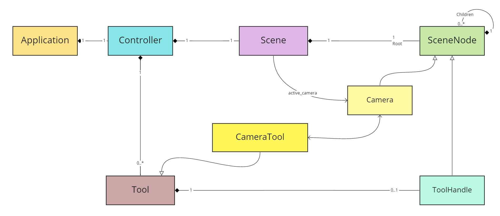
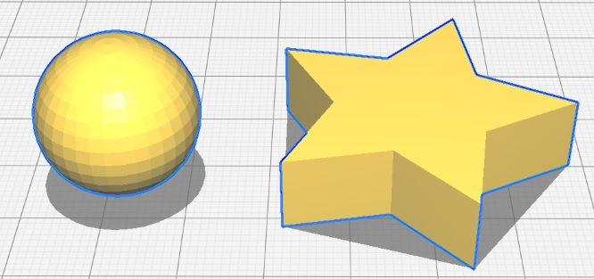
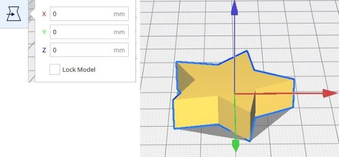
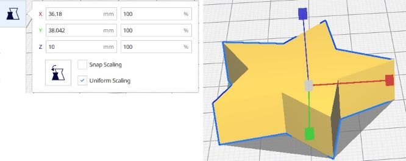
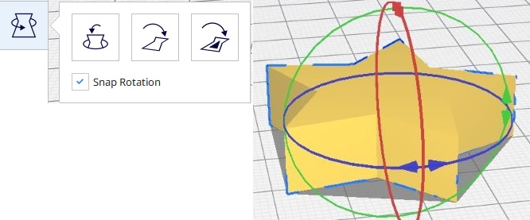
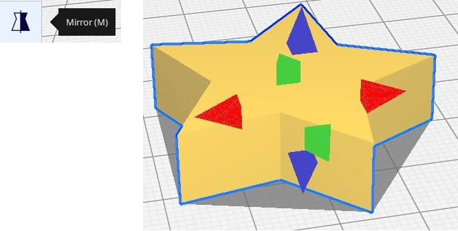
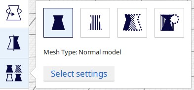
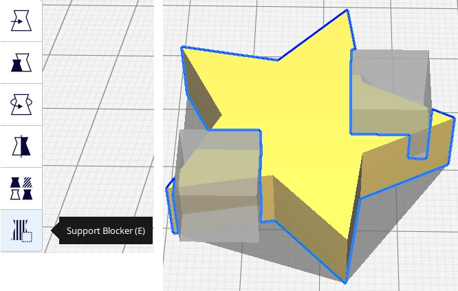

# Tools

Tools are plugin objects which are used to manipulate or interact with the scene and the objects (node) in the scene. 

Tools live inside the Controller of the Application and may be associated with ToolHandles. Some of them interact with the scene as a whole (such as the Camera), while others interact with the objects (nodes) in the Scene (selection tool, rotate tool, scale tool etc.). The tools that are available in Cura (excluding the ones provided by downloadable plugins) are the following:

  * [CameraTool](#cameratool)
  * [SelectionTool](#selectiontool)
  * [TranslateTool](#translatetool)
  * [ScaleTool](#scaletool)
  * [RotateTool](#rotatetool)
  * [MirrorTool](#mirrortool)
  * [PerObjectSettingsTool](#perobjectsettingstool)
  * [SupportEraserTool](#supporteraser)

*****

### CameraTool

The CameraTool is the tool that allows the user to manipulate the Camera. It provides the functions of moving, zooming, and rotating the Camera. This tool does not contain a handle.

### SelectionTool
This tool allows the user to select objects and groups of objects in the scene. The selected objects gain a blue outline and become available in the code through the Selection class. 

This tool does not contain a handle.

### TranslateTool

This tool allows the user to move the object around the build plate. The TranslateTool is activated once the user presses the Move icon in the tool sidebar or hits the shortcut (T) while an object is selected. 

The TranslateTool contains the TranslateToolHandle, which draws the arrow handles on the selected object(s). The TranslateTool generates TranslateOperations whenever the object is moved around the build plate.

### ScaleTool

This tool allows the user to scale the selected object(s). The ScaleTool is activated once the user presses the Scale icon in the tool sidebar or hits the shortcut (S) while an object is selected. 

The ScaleTool contains the ScaleToolHandle, which draws the box handles on the selected object(s). The ScaleTool generates ScaleOperations whenever the object is scaled.

### RotateTool

This tool allows the user to rotate the selected object(s). The RotateTool is activated once the user presses the Rotate icon in the tool sidebar or hits the shortcut (R) while an object is selected. 

The RotateTool contains the RotateToolHandle, which draws the donuts (tori) and arrow handles on the selected object(s). The RotateTool generates RotateOperations whenever the object is rotated or if a face is selected to be laid flat on the build plate. It also contains the `layFlat()` action, which generates the [LayFlatOperation](operations.md#layflatoperation).

### MirrorTool

This tool allows the user to mirror the selected object(s) in the required direction. The MirrorTool is activated once the user presses the Mirror icon in the tool sidebar or hits the shortcut (M) while an object is selected. 

The MirrorTool contains the MirrorToolHandle, which draws pyramid handles on the selected object(s). The MirrorTool generates MirrorOperations whenever the object is mirrored against an axis.

### PerObjectSettingsTool

This tool allows the user to change the mesh type of the object into one of the following:

  * Normal Model
  * Print as support
  * Modify settings for overlaps
     - Infill mesh only
     - Cutting mesh
  * Don't support overlaps

Contrary to other tools, this tool doesn't have any handles and it does not generate any operations. This means that once an object's type is changed it cannot be undone/redone using the OperationStack. This tool adds a [SettingOverrideDecorator](scene.md#settingoverridedecorator) on the object's node instead, which allows the user to change certain settings only for this mesh.

### SupportEraser tool

This tool allows the user to add support blockers on the selected model. The SupportEraserTool is activated once the user pressed the Support Blocker icon in the tool sidebar or hits the shortcut (E) while an object is selected. With this tool active, the user can add support blockers (cubes) on the object by clicking on various places on the selected mesh.

The SupportEraser uses a GroupOperation to add a new CuraSceneNode (the eraser) in the scene and set the selected model as the parent of the eraser. This means that the addition of Erasers in the scene can be undone/redone. The SupportEraser does not have any tool handles.